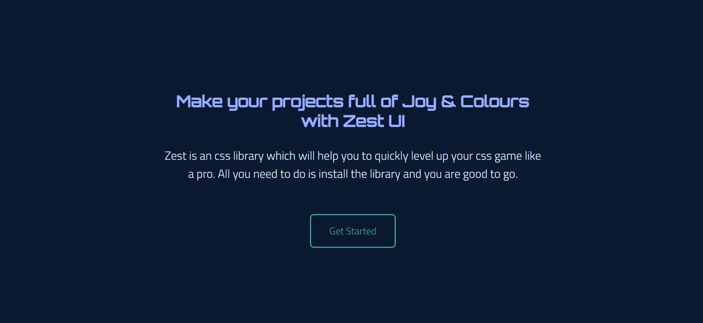
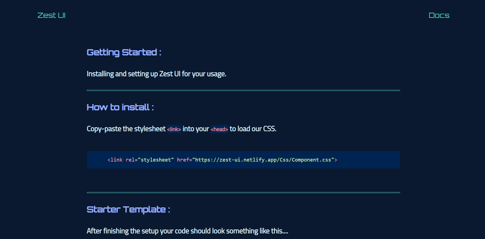
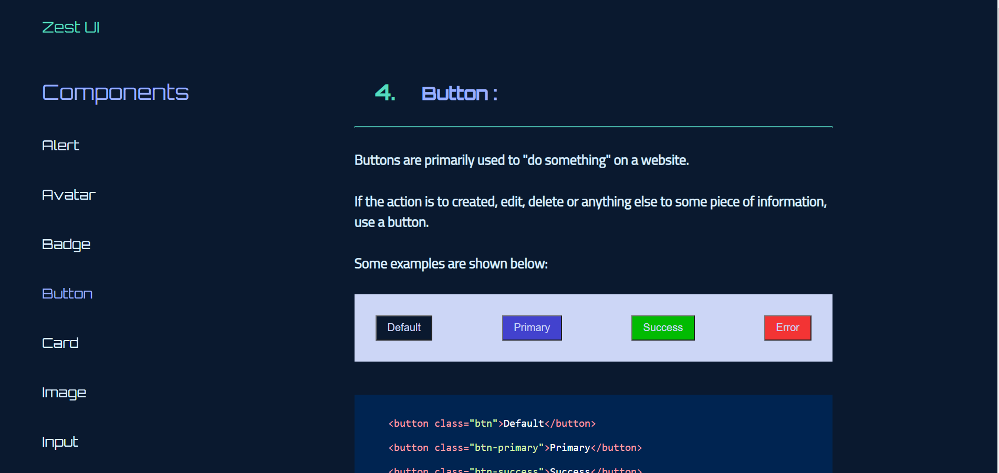

# Zest UI

Zest is an css library which will help you to quickly level up your css game like a pro. All you need to do is install the library and you are good to go

## Documentation

[Zest](https://zest-ui.netlify.app/)

# Components :

Alert 

Avatar

Badge

Button

Card

Image

List

Toast

Rating 

Modal 

Navigation 

Slider

## Screenshots

